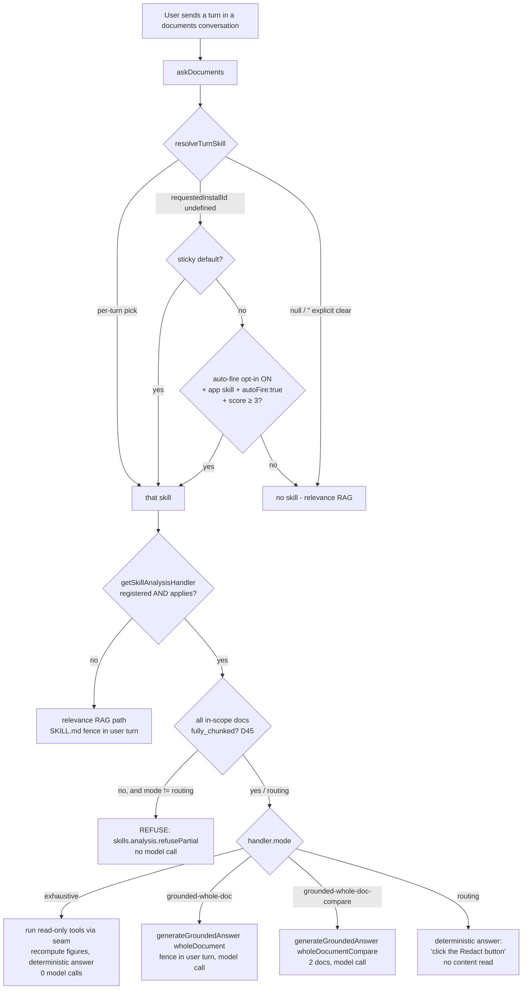
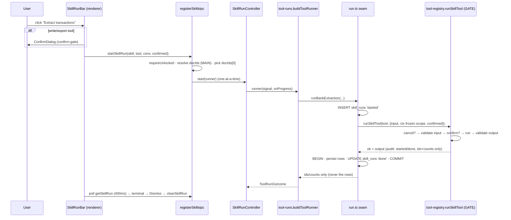
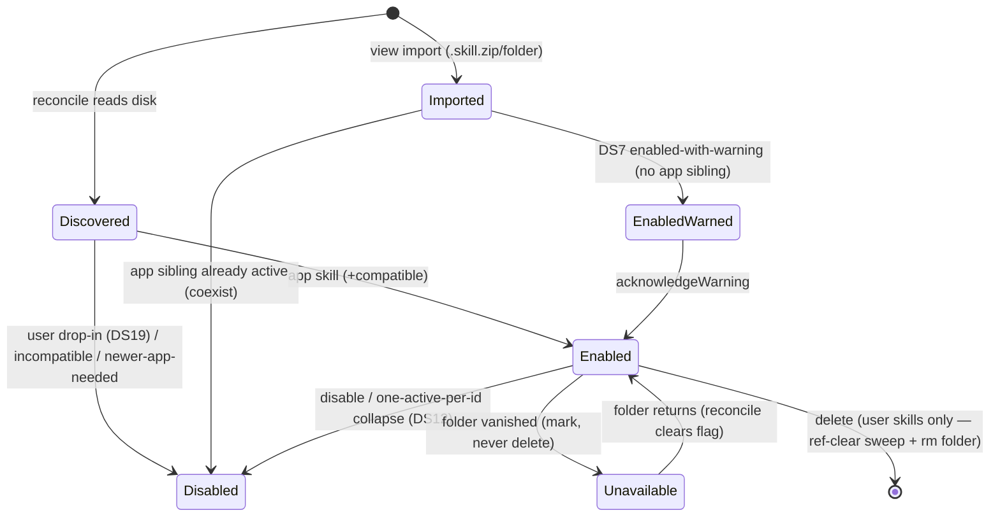

# Skills & Tools — multi-persona flow audit (2026-06-26)

> Scope: the whole **Skills & Tools** subsystem — skill packages, the Tier-2 tool gate, how a turn
> triggers a skill, how a skill triggers a tool, and the chat/Settings UI/UX flow. This is a
> **read-only audit** (no code changed). It cross-checks the code against the design records in
> [`architecture.md`](architecture.md) "Skills — design record" (§1–§21),
> [`security-model.md`](security-model.md), [`known-limitations.md`](known-limitations.md), and
> [`rag-design.md`](rag-design.md) §14.
>
> Method: every file under [`apps/desktop/src/main/services/skills/`](../apps/desktop/src/main/services/skills/)
> plus the IPC ([`registerSkillsIpc.ts`](../apps/desktop/src/main/ipc/registerSkillsIpc.ts), the analysis
> routing in [`registerRagIpc.ts`](../apps/desktop/src/main/ipc/registerRagIpc.ts)) and the renderer
> (chat picker/run bar, `lib/skillruns.ts`, `SkillsTab`) was read in full, plus all eight bundled
> `app-skills/`. Two independent persona sub-audits (security/privacy; test-coverage) triangulated the
> findings.

**Headline:** the subsystem is **mature, well-factored, and security-solid** — the untrusted-skill-as-input
threat model holds (the gate, the frozen scope, the content-class boundary, the ReDoS-hardened parsers).
**No CRITICAL/HIGH issues.** The findings are: a cluster of **documentation drift** (the docs over-count
the bundled skills and still describe a deleted ReDoS mitigation), a few **correctness/consistency**
defects (a substring categorizer bug, two divergent categorize engines), several **performance**
redundancies in the analysis handlers (each read-only tool is run *and then recomputed*), and a set of
**UX gaps** around multi-document scope, a hidden LLM side-effect, and suggestion discoverability.

---

## 1. The subsystem at a glance

Two tiers, exactly as the spec divides them:

- **Tier 1 — instruction skills** (`kind: instruction`): inject fenced reference text into the prompt;
  nothing executes. Six ship: `meeting-protocol`, `contract-brief`, `share-safe-review`,
  `deadline-obligation-finder`, `what-changed` (instruction) + the fence path of the tool skills.
- **Tier 2 — tool skills** (`kind: tool`): declare app-owned tools that run **only when the app
  orchestrates them from a user action** (never the model parsing `tool_calls`). Three ship:
  `bank-statement`, `invoice` (extract/validate/categorize/summarize/export), `document-redaction`
  (read-transform-export).

```
┌──────────────────────────────────────────────────────────────────────────────────────┐
│  ON DISK (plain folders, OUTSIDE the encrypted workspace — DS3/DS19)                    │
│    app-skills/<id>/SKILL.md   (trust=app, read-only)                                    │
│    user-skills/<id>/SKILL.md  (trust=user, read-write, drop-ins install DISABLED)       │
└───────────────┬────────────────────────────────────────────────────────────────────────┘
                │ discover + validate (shared parser: shared/skill-manifest.ts)
                ▼
┌──────────────────────────────────────────────────────────────────────────────────────┐
│  REGISTRY (services/skills/registry.ts)  — `skills` table = DERIVED index/state cache   │
│    reconcile (insert/update/mark-unavailable) · one-active-per-id · enable/disable      │
└───────────────┬────────────────────────────────────────────────────────────────────────┘
                │
       ┌────────┴───────────────────────────────────────────────────────────────┐
       ▼                                                                          ▼
┌─────────────────────────────┐                          ┌────────────────────────────────────┐
│ SELECTION (per turn)         │                          │ TIER-2 TOOL EXECUTION                │
│  turn.ts  resolveTurnSkill   │                          │  tool-registry.ts  (the GATE)        │
│   ├ per-turn pick (picker)   │                          │   validate-in → confirm → run        │
│   ├ sticky default (conv)    │                          │     (frozen scope) → validate-out    │
│   └ auto-fire (autofire.ts)  │                          │  tool-runs.ts (dispatch → seam)      │
│  prompt.ts  buildSkillFence  │                          │  run.ts / invoice-run.ts (persist)   │
│  suggest.ts (in-picker offer)│                          │  run-controller.ts (1-at-a-time UX)  │
└─────────────────────────────┘                          └────────────────────────────────────┘
       │                                                                          │
       └───────────────────────────┬──────────────────────────────────────────┘
                                    ▼
                ┌──────────────────────────────────────────────────┐
                │ CHAT TURN (registerRagIpc.askDocuments)            │
                │  resolve skill → analysis handler? ──yes──► run    │
                │                              └──no──► relevance RAG │
                └──────────────────────────────────────────────────┘
```

---

## 2. Flow visualizations

### 2.1 How a skill is *triggered* and what path the turn takes



### 2.2 The Tier-2 tool gate (button path) and run lifecycle



### 2.3 The three independent execution lanes that can touch the bank/invoice tables

```
                         ┌───────────────────────────────────────────────┐
   chat question  ──────►│ LANE A: chat slot (acquireChatSlot)            │
   ("summarize this")    │   analysis handler auto-runs read-only tools   │──┐
                         └───────────────────────────────────────────────┘  │
                                                                             │   bank_statements
   "Extract" button  ───►┌───────────────────────────────────────────────┐ ├──►bank_transactions
                         │ LANE B: SkillRunController (1-at-a-time)        │ │   invoices / line_items
                         │   SEPARATE lane; chat & doctasks do NOT observe │──┤   (NO cross-lane lock)
                         └───────────────────────────────────────────────┘  │
                                                                             │
   categorize / auto- ──►┌───────────────────────────────────────────────┐ │
   offer-on-extract      │ LANE C: DocTaskManager (chat↔task exclusion)   │──┘
                         │   the LLM categorizer runs here (D26-safe)     │
                         └───────────────────────────────────────────────┘
   Lane A and Lane B are mutually unaware → see Finding P/C-1 (concurrency).
   ✅ Phase 9: every WRITE-capable section is now serialized PER DOCUMENT by `withDocumentLock`
      (`skills/doc-lock.ts`) — the lanes no longer race the bank/invoice tables (unrelated docs
      still run concurrently). See Finding PC-1 and Phase 9.
```

### 2.4 Skill lifecycle (import → use → delete)



---

## 3. Findings by severity

Severity reflects user-visible impact × likelihood. **None are CRITICAL/HIGH.** IDs are referenced by
persona section below.

| # | Severity | Area | Finding | Where |
|---|----------|------|---------|-------|
| D-1 | MEDIUM | Docs | ✅ **fixed (Phase 1)** — Docs claimed **"nine" bundled app skills**; only **eight** exist on disk | architecture.md DS17, BUILD_STATE, drive-layout.md, README |
| D-2 | MEDIUM | Docs/Security | ✅ **fixed (Phase 1)** — Docs still described the **deleted `globToRegExp` ">10 wildcards" ReDoS cap**; code now uses a linear `globMatches` | architecture.md §12/§13, security-model.md, BUILD_STATE |
| C-1 | MEDIUM | Correctness | ✅ **fixed (Phase 2)** — `categorizeRow` used raw `desc.includes()` (so `fee ⊂ coffee` mis-files as *Fees*); now shares the word-boundary `wordIncludes` (moved to `tools/money.ts`) with the LLM `prefilterCategory`, so both paths agree | `tools/bank-statement.ts` `categorizeRow`, `tools/money.ts` `wordIncludes` |
| C-2 | MEDIUM | Consistency | ✅ **fixed (Phase 2, option A)** — **Two categorize engines** gave divergent results by entry point; the deterministic chat breakdown now **labels itself rule-based** (`categoryRuleBased`, points at the Categorize button), preserving the 0-model-call chat contract | `analysis/bank-statement.ts` `buildBankAnswer`, en/de `categoryRuleBased` |
| P-1 | MEDIUM | Performance | ✅ **fixed (Phase 4, approach A)** — the handler now loads the rows **once** (with ids) and hands them to the downstream seams as `preloaded`; the seams **return their validated `output`** for in-process reuse instead of the handler recomputing. A non-category bank question now issues **one** `FROM bank_transactions` read (was three); invoice likewise **one** `invoice_line_items` read (was two). `skill_runs` lifecycle + ids/counts audit unchanged | `analysis/bank-statement.ts`, `analysis/invoice.ts`, `run.ts`, `invoice-run.ts` |
| P-2 | MEDIUM | Performance | ✅ **fixed (Phase 4)** — kept the `summarize_cashflow` run (its audit trio stays — approach A, not B) but it no longer re-reads the rows: it reuses the handler's single `preloaded` load, and its `CashflowSummary` is reused rather than recomputed | `run.ts` `runCashflowSummary`, `analysis/bank-statement.ts` |
| U-1 | MEDIUM | UX/Correctness | ✅ **fixed (Phase 5, Minimal)** — `listRunnableTools` now returns the in-scope target **ids** alongside the tools; the renderer maps ids→**names** from its own loaded list (no title crosses the IPC), shows the single doc's name or a **Radix chooser** when >1, and passes the chosen `documentId` to `startSkillRun`, which **validates** it is in the resolved scope (else `documentOutOfScope`). `documentCount` stays the honest **1**. Redaction routing answer is count-honest (`answerMulti`) | `registerSkillsIpc.ts` `listRunnableTools`/`startSkillRun`, `SkillRunBar.tsx`, `ChatScreen.tsx`, `analysis/redaction.ts` |
| U-2 | MEDIUM | UX/Surprise | ✅ **fixed (Phase 6, explicit offer)** — the silent background-categorize enqueue is **removed** from the extract runner; after a successful rows>0 extract the run-bar **result row** offers a one-tap **"Categorize transactions"** follow-up (user-initiated), targeting the SAME document via a renderer-remembered id (`runTargetId`). The audit/run state stay content-free; the deterministic 0-model chat breakdown is unchanged | `tool-runs.ts` `buildToolRunner` extract case, `SkillRunBar.tsx`, `ChatScreen.tsx` |
| PC-1 | MEDIUM | Concurrency | ✅ **fixed (Phase 9)** — a per-document async mutex (`skills/doc-lock.ts` `withDocumentLock`, a re-entrant `Map<documentId, Promise>` chain) now serializes every WRITE-capable section across all three lanes (A chat analysis, B `SkillRunController`, C `DocTaskManager` categorize): the write seams self-lock, and the two multi-step lanes (analysis handlers + `runCategorize`) wrap their whole sequence. A chat re-extract DELETE can no longer race a button run / categorize on the same statement. In-memory, per-document (unrelated docs still concurrent), no new capability/schema/IPC, `finally`-released + finer than `acquireChatSlot` (no deadlock) | `skills/doc-lock.ts`, `run.ts`, `invoice-run.ts`, `analysis/bank-statement.ts`, `analysis/invoice.ts`, `doctasks/manager.ts` |
| S-1 | MEDIUM | Security (DoS) | ✅ **fixed (Phase 8)** — `inflateEntry` now rejects any member whose central-directory **`compressedSize` exceeds `maxFileBytes`** *before* slicing/inflating (for both STORE and DEFLATE), bounding the synchronous inflate **input**, not only its `maxOutputLength` output. Reuses `fileTooLarge`. Proven by a spy that `inflateRawSync` is never reached (with a positive control) | `installer.ts` `inflateEntry` |
| U-3 | LOW→MED | UX | ✅ **fixed (Phase 7, inline closed-trigger label)** — `ChatScreen` now recomputes the deterministic offer **proactively as the draft changes** (debounced ~400 ms, only when no skill is picked) and `SkillPicker` mirrors it as a quiet, named **"Suggested: &lt;skill&gt;" hint on the CLOSED trigger** (`chat.skill.suggestedHint`); one tap selects it. Still inert until tapped — no canvas chip, no settings key, never auto-applied (§22-D3); an explicit "None" sets a per-draft `suggestionDismissed` flag so it never re-nags. `suggestSkills` still logs nothing (privacy test green) | `ChatScreen.tsx` `refreshSuggestion`/suggest effect, `SkillPicker.tsx` closed hint |
| A-1 | LOW→MED | Architecture | For tool skills the **SKILL.md body is inert on the primary answer path** — the deterministic answer format is reimplemented in TS (`buildBankAnswer`/`buildInvoiceAnswer`); editing the body only affects the off-topic relevance fallback | `analysis/bank-statement.ts:294`, `analysis/invoice.ts:201` |
| S-2 | LOW→MED | Security | ✅ **fixed (Phase 8)** — `stageZip` now **re-asserts `safeRelPath` on the stripped path** and **rejects a colliding `relPath`** (a `Set` of seen paths) with a new content-free `duplicatePath` code, so a later duplicate can't last-writer-wins shadow a preview-validated `SKILL.md`. EOCD-first-match recorded as an accepted residual in `security-model.md` | `installer.ts` `stageZip`, `SKILL_IMPORT_ERRORS.duplicatePath`, `SkillsTab.tsx`, en/de |
| L-1 | LOW | LLM | ✅ **fixed (Phase 2)** — Categorizer dropped a whole 20-row batch on any parse failure; now `batchMaxTokens` is length-aware AND an unparseable reply is retried once before the (honest) drop | `categorizer.ts` `batchMaxTokens`/`categorizeBatch` |
| L-2 | LOW | Robustness | ✅ **fixed (Phase 2)** — `categorizeBatch` accumulated model output **unbounded**; the streamed reply is now bounded by a char cap (`batchMaxTokens * 8`) and the batch is dropped past it | `categorizer.ts` `streamBatchReply` |
| C-3 | LOW | Correctness | ✅ **fixed (Phase 3)** — `assessCompleteness` now sums the `opening + Σ == closing` tie in INTEGER CENTS (`Math.round(amount*100)`), an exact compare; float drift can no longer flip a tying statement to `contradicted`. Read-time only (no version bump) | `tools/bank-statement.ts` `assessCompleteness`, `money.ts` `MONEY_EPS` |
| C-4 | LOW | Correctness | ✅ **fixed (Phase 3)** — `KONTOSTAND_PER` removed from both label lists; `extractStatementBalances` disambiguates by DATE (earliest=opening / latest=closing; a lone line = closing-only → `unverified`, not `contradicted`). Changes persisted balances → `BANK_EXTRACTOR_VERSION` bumped 1→2 | `tools/bank-statement.ts` `extractStatementBalances`, `KONTOSTAND_PER`, `BANK_EXTRACTOR_VERSION` |
| X-1 | LOW | Consistency | **Three near-duplicate scope→docs queries** with subtly different predicates (`resolveInScopeDocumentIds` omits the `EXISTS chunks` check the analysis handlers require) | `tool-runs.ts:69`, `scope-signals.ts:11`, `analysis/*.ts inScopeDocuments` |
| X-2 | LOW | Cleanup | `count_selected_documents` reference tool is still registered but never wired/declared (only the gate test uses it) | `tool-registry.ts:187-217` |
| R-1 | LOW | Residual | Auto-fire ships but only `document-redaction` opts in; the eval corpus (33 turns) covers only the **original four** skills | architecture.md §18, BUILD_STATE |
| R-2 | LOW | Residual | The live **run-surface Playwright eyeball was never captured** (honest deferral, documented) | `docs/design-review/skills-s12/README.md` |
| T-1 | LOW | Testing | No test covers cross-lane concurrency (PC-1), multi-doc `docIds[0]` (U-1), the auto-offer side-effect (U-2), or the categorizer whole-batch-drop/0-row edge cases | tests map §6 |

---

## 4. Persona view 1 — Architecture & contracts

**Strengths (worth preserving).** The layering is genuinely clean and the service boundaries match the
spec. Disk-is-truth + derived `skills` cache (DS1) with mark-unavailable-never-delete is correct and
handles the portable-drive remount case. The **single `resolveTurnSkill`** feeds *both* chat channels
([`turn.ts`](../apps/desktop/src/main/services/skills/turn.ts)), closing the A1 "documents conversation
silently gets no skill" gap. The gate (`runSkillTool`) and the `declared ∩ registry ∩ userGrant`
intersection make "a skill can never register a tool" structurally true. The analysis-handler registry
mirrors the tool registry (no import-time side effects, app-owned).

**A-1 (LOW→MEDIUM) — the SKILL.md body is inert on the primary tool-skill answer path.** For
`bank-statement`/`invoice`, when the analysis handler *applies* the answer is **deterministic TS**
([`buildBankAnswer`](../apps/desktop/src/main/services/skills/analysis/bank-statement.ts#L294),
[`buildInvoiceAnswer`](../apps/desktop/src/main/services/skills/analysis/invoice.ts#L201)) — it does not
read the SKILL.md instructions at all. The honesty posture ("surface unreconciled rows before the total",
"never invent a figure") is hand-reimplemented in code. The SKILL.md body only influences the *off-topic
relevance fallback* (where it rides the fence). This is fine for read-only app content, but it is a
**conceptual contract gap**: the docs say the answer "honours `app-skills/bank-statement/SKILL.md`," while
in practice the body and the code can drift apart with nothing enforcing parity. Recommend a one-line
note in §19 that the honesty posture for the exhaustive path is **code-enforced, not body-driven**, and a
test asserting the SKILL.md honesty bullets ⇔ the `buildBankAnswer` branches.

**X-1 (LOW) — scope→documents is resolved three different ways.**
[`resolveInScopeDocumentIds`](../apps/desktop/src/main/services/skills/tool-runs.ts#L69) (run path)
filters only `status='indexed'`; the analysis handlers' `inScopeDocuments` add `AND EXISTS (chunks)`;
[`inScopeDocSignals`](../apps/desktop/src/main/services/skills/scope-signals.ts#L11) returns titles+MIME.
A document that is `indexed` but not yet chunked is "runnable" via the button (the run re-extracts from
the stored copy, so chunks aren't needed) but is invisible to the chat analysis handler. Benign today,
but four copies of the same predicate is a latent drift surface — extract one `documentsInScope(scope,
{requireChunks})` helper.

**X-2 (LOW) — dead reference tool.** `count_selected_documents`
([`tool-registry.ts:187`](../apps/desktop/src/main/services/skills/tool-registry.ts#L187)) is registered
but no skill declares it and it is not in `WIRED_TOOL_NAMES`. Keep it if it is still wanted as the gate's
canary; otherwise drop it to avoid implying a capability that no longer exists.

---

## 5. Persona view 2 — Security & privacy

**The threat model holds.** An independent security pass confirmed the capability ceiling is real:
`SkillToolContext` carries no DB/SQL/FS/net handle; the gate freezes `documentIds`
([`tool-registry.ts:302`](../apps/desktop/src/main/services/skills/tool-registry.ts#L302)) and
`readDocumentChunks` refuses any out-of-scope id; `getRegisteredTool` uses `hasOwnProperty` (no
prototype-pollution reach). The **content-class boundary is held consistently** — installer rejection
strings are a fixed enum that never interpolates member names/content, `validateJsonSchema` deliberately
never echoes offending keys/values, audit meta is `{skillId, toolName, documentCount}` only, and the
CSV/redaction seams never log path or content. Permission clamping is strictly restrict-only and
self-declared `trust` is ignored. The money/redaction/glob regexes are all ReDoS-hardened (bounded
quantifiers + the linear `globMatches`). The LLM categorizer sends only batch-local index + signed
amount + truncated description to the **local** model, with a grammar-constrained enum + per-assignment
validation + drop-to-`Uncategorized`, so a crafted transaction description cannot inject an off-list
label or escape into a sink.

**S-1 (MEDIUM, DoS only) — `compressedSize` is trusted to slice + inflate before any per-file bound.**
[`entryDataRange`/`inflateEntry`](../apps/desktop/src/main/services/skills/installer.ts#L208) bound the
*output* via `maxOutputLength` (the real zip-bomb backstop), but the *compressed slice* can be up to the
~8 MiB total cap, and the cheap declared-size pre-check sums the spoofable `uncompressedSize` (a crafted
archive sets it to 0). Inflating a near-8 MiB slice runs synchronously on the main process first → a
transient stall on import (a user action, so impact is bounded). **Fix:** reject any entry with
`compressedSize > maxFileBytes` before slicing (a legitimate text member never compresses to >1 MiB).

**S-2 (LOW→MEDIUM) — duplicate stripped paths overwrite silently.**
[`stripCommonPrefix`](../apps/desktop/src/main/services/skills/installer.ts#L279) output is not
re-validated and two distinct members can collapse to the same `relPath`, so `writeStaged` does a
last-writer-wins `writeFileSync` — a benign SKILL.md the preview validated could be shadowed by a later
duplicate entry. **Fix:** detect `relPath` collisions in `stageZip` and re-assert `safeRelPath` on the
stripped result. (A related low note: the backward EOCD scan takes the *first* record found, a classic
parser-differential vs a stock unzip — every member is still fully validated, so it is hardening, not an
escape.)

**S-3 (documented residual) — app-skill integrity is by location, not signature.** A process that can
write to `app-skills/` can plant a `trust=app` skill (which installs enabled, is auto-fire-eligible, and
gets the wider trust path). This is **accepted + documented** ([`security-model.md`] "App-skill integrity
is by location, not signature"), consistent with the engine-binary residual. No action beyond keeping the
doc honest.

---

## 6. Persona view 3 — Performance & LLM efficiency

**Good, deliberate wins already in place.** `cache_prompt: true` (PERF-1) makes the plain-chat system-prefix
fence a one-time prefill; the per-turn `loadSkillPackage` is cached by `(mtime,size)` (PERF-2, ~20×); the
fence is pre-sized so it never starves the answer; `globMatches` is linear. The §17 latency record is a
model of measure-before-theorize.

**P-1 / P-2 (MEDIUM) — the analysis handlers do the work twice.** On a single bank question the
[`run()`](../apps/desktop/src/main/services/skills/analysis/bank-statement.ts#L417) path:

1. (maybe) `runBankExtraction` — loads + persists rows;
2. `runCashflowSummary` — `prepareStatementRun` **re-loads all rows**, runs the tool through the gate,
   writes a `skill_runs` row + audit, and **persists nothing**;
3. `runBalanceValidation` — `prepareStatementRun` **re-loads all rows** again, persists the reconciled flag;
4. (maybe) `runCategorization` — **re-loads all rows** again;
5. `loadStatementRowsWithCategories` — **loads all rows yet again**;
6. then recomputes `summarizeCashflow(rows)` and `reconcileBalances(rows)` from those rows.

So `summarize_cashflow` and `reconcile` are computed **twice** and the statement rows are read from SQLite
**3–4×** per question. For a 10k-row statement (the `MAX_TRANSACTIONS` cap) this is real, repeated work on
the chat hot path. The seam-runs exist "for their `skill_runs` lifecycle + ids/counts audit" (D46), but
**`summarize_cashflow` persists nothing at all** ([`run.ts:630`](../apps/desktop/src/main/services/skills/run.ts#L630)),
so its run contributes only an audit row + a wasted reload. The invoice handler mirrors the same
double-run-then-recompute ([`analysis/invoice.ts:282`](../apps/desktop/src/main/services/skills/analysis/invoice.ts#L282)).
**Recommendation:** either (a) have the seams *return the structured output* so the handler reuses it
instead of recomputing, or (b) drop the audit-only `runCashflowSummary` from the analysis path and compute
the summary purely. Both keep the §14 ceiling and the audit semantics intact (a deterministic read needs
no per-tool audit row).

**L-1 (LOW) — categorizer batch can truncate.** `batchMaxTokens(20) = 544`
([`categorizer.ts:75`](../apps/desktop/src/main/services/skills/categorizer.ts#L75)). A batch of 20 rows
with long descriptions can produce JSON longer than that → truncated → `JSON.parse` throws → the **whole
20-row batch drops to `Uncategorized`** with no retry. With grammar-constrained decoding this is rare, but
a systematically-verbose statement degrades silently. Consider a smaller batch for long-description rows
or a single-retry on parse failure.

**L-2 (LOW) — unbounded output accumulation.** `for await (token) text += token`
([`categorizer.ts:181`](../apps/desktop/src/main/services/skills/categorizer.ts#L181)) trusts the local
runtime to honour `maxTokens`; a looping model grows `text` unboundedly. Cap defensively and drop the batch.

---

## 7. Persona view 4 — LLM answer quality & prompt design

**Strong.** The fence design (untrusted **data** block, BEGIN/END framing + the `SKILL_GUARD_LINE` last
app-authored line, in `system` for plain chat / the user turn for grounded) is exactly right for
prompt-injection resistance, and `stripSkillFenceEcho` is a clean defense-in-depth against the observed
delimiter-echo. The grammar-constrained categorizer (enum + drop-to-`Uncategorized`) is the right honesty
posture: a category is not a figure, so a mislabel never moves the verified total. The whole-doc engine
(Wave 2/3) correctly applies the fence at *every* map-reduce step and stamps honest `capped`/`tree`
coverage.

**C-2 (MEDIUM) — two categorize engines, divergent results.** The same "categorize my statement" intent
resolves differently by entry point:

- **Chat "breakdown" question** → `bankStatementAnalysisHandler` runs the **deterministic** rule pass
  (`runCategorization`, 0 model calls) when nothing is categorized
  ([`analysis/bank-statement.ts:475`](../apps/desktop/src/main/services/skills/analysis/bank-statement.ts#L475));
- **"Categorize" run-bar button** → routes through the **LLM** doctask
  ([`tool-runs.ts:259`](../apps/desktop/src/main/services/skills/tool-runs.ts#L259));
- **"Extract" button** → auto-enqueues the **LLM** categorize in the background (U-2).

So a user can get rule-based categories from a chat question and LLM categories (richer taxonomy:
Groceries/Dining/…) from the button — for the same statement, with the breakdown's "model-assisted" note
flipping depending on which ran first. The persistence-reuse logic copes (it won't overwrite LLM labels),
but the *user-facing result is path-dependent*. Recommend the chat breakdown either reuse the LLM doctask
(consistency) or clearly state it used the simpler rule set.

**C-1 (MEDIUM) — substring false positive in the deterministic categorizer.**
[`categorizeRow`](../apps/desktop/src/main/services/skills/tools/bank-statement.ts#L493) uses raw
`desc.includes(rule.pattern)`, so `"coffee"` matches `fee` → **Fees**, `"atmosphere"` → **Cash** (`atm`),
etc. The LLM prefilter explicitly fixed exactly this with a Unicode word-boundary `wordIncludes`
([`categorizer.ts:136`](../apps/desktop/src/main/services/skills/categorizer.ts#L136)) — but the
deterministic path (used by `runCategorization` *and* the analysis fallback `categorizeRow`) was never
updated. Reuse `wordIncludes` in `categorizeRow` so both paths agree.

---

## 8. Persona view 5 — UX & UI flow

**Calm and consistent.** The composer picker, per-message glyph, confirm-gated writes, content-free run
bar (offer → busy → result), and the localized failure copy (errorCode → catalog, never raw English) are
all on-brand. The auto-fire surprise-mitigation (opt-in off by default + the per-turn "answer without it"
undo) is careful. The compose-vs-attach skill carry-over fix (`carrySkillToConversation`) closes the
recently-reported reset bug.

**U-1 (MEDIUM) — multi-document scope is silently first-doc-only.** With several indexed documents in
scope, `listRunnableTools` offers the tools (`docIds.length >= 1`) but `startSkillRun` runs on
**`docIds[0]`** and hardcodes `documentCount: 1`
([`registerSkillsIpc.ts:314`](../apps/desktop/src/main/ipc/registerSkillsIpc.ts#L314)). The button says
"Extract transactions" with no indication *which* document, the busy row says "on 1 document," and the
user has no picker. The redaction routing answer ("click the Redact button") has the same blind spot. For
the single-doc case (the norm) this is invisible; for multi-doc it is a quiet correctness/UX gap. Either
surface the target document name in the offer/busy row, or add a one-document chooser when scope > 1.

**U-2 (MEDIUM) — a read-only button has a hidden model side-effect.** Clicking **"Extract transactions"**
(advertised read-only, no confirm) auto-enqueues an **LLM categorize doctask** in the background when rows
were extracted ([`tool-runs.ts:229`](../apps/desktop/src/main/services/skills/tool-runs.ts#L229)). The run
bar shows "Extracted N transactions" (done) while the GPU/CPU is now busy with an uninvited model run that
the run bar does not surface (it lives in the doctask lane). For a privacy/calm-posture app this is a
"no-surprises" violation: a deterministic, read-only action triggers an LLM pass the user did not ask for.
Recommend either making the categorize an explicit follow-up offer or showing it in the run/task surface.

**U-3 (LOW→MEDIUM) — the suggestion is buried.** The one-tap suggestion is recomputed only in
[`onSkillPickerOpenChange`](../apps/desktop/src/renderer/screens/ChatScreen.tsx#L625) — i.e. *after* the
user decided to open the picker. A user who never opens "Skill: none ▾" never sees the nudge. This is the
deliberate §22-D3 "no canvas chip" choice, but it means the suggestion heuristic (a real asset) is
effectively invisible in normal use. Consider a quiet inline hint on the closed picker trigger when a
high-confidence suggestion exists (still no auto-apply).

---

## 9. Persona view 6 — Documentation & contract fidelity

**D-1 (MEDIUM) — the bundled-skill count is wrong everywhere.** Eight `SKILL.md` files exist on disk
(`bank-statement`, `invoice`, `meeting-protocol`, `contract-brief`, `share-safe-review`, `what-changed`,
`deadline-obligation-finder`, `document-redaction`), but architecture.md **DS17** ("Nine bundled app
skills now ship"), BUILD_STATE ("grew from four to nine" — yet it lists *four* new), `drive-layout.md`,
and `README` all say **nine**. Either a ninth skill was planned and never committed, or "four new + four
existing = eight" was miscounted as nine and propagated. Reconcile the count (and the "three Tier-2 + the
rest Tier-1" arithmetic in DS17 — that is 3 + 5 = 8).

**D-2 (MEDIUM) — the ReDoS mitigation description is stale.** The current code uses a **linear,
non-backtracking `globMatches`** two-pointer matcher with **no wildcard cap**
([`selector.ts:54`](../apps/desktop/src/main/services/skills/selector.ts#L54)) — the `globToRegExp`
">10 `*` wildcards refused" guard was *deleted* (vuln-scan 2026-06-21). But:
- architecture.md **§12** ("the selector refuses a wildcard-heavy glob — see §13 S2") and **§13 S2**
  ("`selector.globToRegExp` refuses a glob with >10 `*` wildcards"),
- security-model.md ("`selector.globToRegExp` refuses a glob with >10 `*` wildcards"),
- BUILD_STATE (same),

all still describe the removed mechanism. Only [`known-limitations.md`](known-limitations.md) is correct.
These now describe a defense that no longer exists and reference a symbol (`globToRegExp`) that is gone —
a contradiction a future reader (or auditor) will trip over. Update §12/§13/security-model to the linear
matcher.

**Minor doc notes.** §16 enumerates `localized.de` for "all four app skills"; in fact all eight carry it
(the feature was extended consistently — just update the count). The §19/§20 records are otherwise
accurate to the code.

---

## 10. Persona view 7 — Testing & verification

The suite is **broad and disciplined** — ~40 skill test files spanning unit/integration/renderer/eval,
with the privacy-sentinel grep (`skills-privacy-guard.test.ts`) driving one secret through every sink. The
gate, manifest, installer matrix, selector/suggest/autofire thresholds, turn resolution + fence, the bank
parser, and the analysis handlers are all well-covered.

**T-1 (LOW) — the gaps cluster exactly on the findings above:**

- **Concurrency** between Lane A (chat analysis) and Lane B (`SkillRunController`) — untested (PC-1).
- **Multi-document `docIds[0]`** selection and the hardcoded `documentCount: 1` — untested (U-1).
- **The auto-offer categorize side-effect** on extract — untested (U-2).
- **Categorizer edge cases** — whole-batch JSON-truncation drop (L-1), 0-row extraction, the exact
  batch boundary (1 row / exactly 20).
- **Completeness-gate numerics** — float drift over many rows (C-3), the single-`Kontostand per` case (C-4).
- **Deterministic-vs-LLM categorize divergence** (C-2/C-1) — no test pins that `categorizeRow` and the
  prefilter agree on `coffee`/`atm`.

Note the **`real-model`**, **`real-data` (PDF gold set)**, and **`manual`** suites are gated by env vars
and **do not run under `npm test`** — so the bank parser's real-PDF recall and the categorizer's real-model
behaviour are measured only on demand. The **live run-surface Playwright eyeball** (R-2) was honestly
deferred, never faked.

---

## 11. Prioritized recommendations

**Documentation (cheap, high-clarity):**
1. **D-1** — fix the bundled-skill count (8, not 9) in DS17 / BUILD_STATE / drive-layout / README; fix the
   "3 Tier-2 + rest Tier-1" arithmetic.
2. **D-2** — rewrite the ReDoS mitigation in architecture.md §12/§13 + security-model.md to the linear
   `globMatches` matcher (drop the dead `globToRegExp`/">10 wildcards" wording).

**Correctness (small, contained):**
3. **C-1** — reuse `wordIncludes` in `categorizeRow` so the deterministic path stops mis-filing
   `coffee`→Fees; add a regression test.
4. **C-2** — make chat-breakdown categorization consistent with the button (reuse the doctask, or label
   the rule-set result honestly).
5. **C-3/C-4** — round the completeness sum to cents before the `MONEY_EPS` compare; handle the single
   `Kontostand per` line so it isn't read as both opening and closing.

**Performance:**
6. **P-1/P-2** — stop double-running + reloading in the analysis handlers: return the seam's structured
   output for reuse, and drop the audit-only `runCashflowSummary` from the analysis path.

**UX:**
7. **U-1** — surface the target document in the run-bar offer/busy row, or add a chooser when scope > 1;
   stop hardcoding `documentCount: 1`.
8. **U-2** — make the auto-categorize-on-extract an explicit offer (or show it in the run/task surface) so
   a read-only button never silently runs the model.
9. **U-3** — show a quiet inline suggestion hint on the closed picker for high-confidence offers.

**Security hardening (DoS):**
10. **S-1** — reject `compressedSize > maxFileBytes` before inflating a zip member.
11. **S-2** — detect duplicate stripped `relPath` collisions and re-validate the stripped path.

**Testing:**
12. **T-1** — add tests for the concurrency lanes (PC-1), multi-doc selection (U-1), the categorize
    side-effect (U-2), and the categorizer/completeness edge cases.

**Cleanup / residuals:**
13. **X-1** extract one `documentsInScope` helper; **X-2** drop or document `count_selected_documents`;
    **R-1** extend the auto-fire corpus when more skills opt in; **R-2** capture the run-surface eyeball on
    a GUI machine.

---

## 12. What is solid (so it isn't "fixed" by accident)

- The Tier-2 **gate order**, the **frozen scope**, the **no-handle `SkillToolContext`**, and "a skill
  cannot register a tool" — the core security invariants are correct and well-tested.
- The **content-class boundary** (ids/counts-only audit, fixed structural error strings, no content in
  logs/IPC) is held consistently across the installer, the gate, the seams, and the categorizer.
- The **fence design** (untrusted data block + guard line + echo-strip) and the **prompt-injection
  containment** ("structural ceiling, not delimiter purity") are sound.
- **Honesty posture**: the completeness gate's three outcomes, the redaction "best-effort, never fully
  anonymized" framing, and the categorizer's drop-to-`Uncategorized` are all correctly defensive.
- The **graceful-degradation** paths (disabled/deleted/unavailable/incompatible skill → resolves to none,
  never an error) and the **mark-unavailable-never-delete** reconcile are robust for the portable-drive case.

---

## 13. Remediation plan (phased)

The fixes are split into **self-contained phases**, each sized to be picked up in a **fresh session**
without needing the rest of this document loaded. Run them roughly in order (low-risk/docs first), but
they are mostly independent — the only soft dependencies are noted. Each phase below restates everything a
new session needs: the findings it closes, the exact files, the concrete steps, the decisions to make, the
tests, and the docs to touch.

### How to run any phase (read this first, every time)

1. **Read [`BUILD_STATE.md`](../BUILD_STATE.md) first** (the live handoff/state file — CLAUDE.md rule), then
   this section's phase, then the cited source files. Confirm the cited **line numbers by symbol search**
   (they are as-of the 2026-06-26 audit and will drift as code changes).
2. **Honour the hard rules** (CLAUDE.md §0 / Skills §14 ceiling): no network/telemetry; the **content
   class** (skill bodies, the draft question, extracted figures, redacted text, document text **and
   document titles/filenames**) is **never logged/audited/echoed** — only ids/counts may cross the IPC/audit
   boundary; the audit payload stays `{skillId, toolName, documentCount}`; schema changes are **additive**
   (new columns nullable); the tool gate adds **no new DB/FS/net capability**.
3. **i18n parity is compile-enforced** (`de: Record<keyof typeof en, string>`) — every new EN key needs a DE
   sibling in [`en.ts`](../apps/desktop/src/shared/i18n/en.ts) / [`de.ts`](../apps/desktop/src/shared/i18n/de.ts).
   LLM prompts stay English (D-L6); user-facing copy is localized.
4. **Per-phase ritual (MANDATORY, CLAUDE.md):** (a) `npm test` green; (b) `npm run typecheck` clean and the
   app still builds; (c) update the affected `docs/` (incl. flipping this audit's finding row to *fixed* and
   updating the relevant architecture.md "Skills — design record" §); (d) update [`BUILD_STATE.md`](../BUILD_STATE.md)
   (status, decisions, data contracts, next actions); (e) commit referencing the phase + finding IDs.
5. **Commit hygiene:** branch off `master` if you are on it; write the message via `git commit -F <tempfile>`
   (PowerShell 5.1 mangles here-strings). Suggested type/scope per phase below.
6. **Decisions:** where a phase says **DECISION**, surface it to the user before implementing if the
   recommended default is not obviously right; record the choice in BUILD_STATE.

> **Severity legend for ordering:** P1 phases are docs/contained correctness (do first); P2 are
> perf/UX/security with moderate blast radius; P3 are larger refactors / decisions.

| Phase | Title | Findings | Risk | Code? |
|-------|-------|----------|------|-------|
| 1 | Documentation truth-up ✅ **fixed (Phase 1)** | D-1, D-2, §16 count, A-1 note | P1 | docs only |
| 2 | Categorization correctness & consistency ✅ **fixed (Phase 2)** | C-1, C-2, L-1, L-2 | P1–P2 | yes |
| 3 | Bank completeness-gate numerics ✅ **fixed (Phase 3)** | C-3, C-4 | P2 | yes (version bump) |
| 4 | Analysis-handler performance ✅ **fixed (Phase 4)** | P-1, P-2 | P2 | yes |
| 5 | Tool-run document targeting (multi-doc) ✅ **fixed (Phase 5)** | U-1 | P2 | yes |
| 6 | Make auto-categorize explicit ✅ **fixed (Phase 6)** | U-2 | P2 | yes (DECISION) |
| 7 | Suggestion discoverability ✅ **fixed (Phase 7)** | U-3 | P2 | yes |
| 8 | Zip importer DoS hardening ✅ **fixed (Phase 8)** | S-1, S-2 | P2 | yes |
| 9 | Cross-lane write safety ✅ **fixed (Phase 9)** | PC-1 | P3 | yes |
| 10 | Cleanup & contract parity | X-1, X-2, A-1 test | P3 | yes |
| 11 | Test backfill & residuals | T-1, R-1, R-2 | P3 | tests/docs |

---

### Phase 1 — Documentation truth-up (D-1, D-2)

**Goal.** Make the docs match the code: the real bundled-skill count, and the current (linear) glob
matcher. Docs-only; **no source changes**, so the per-phase "tests/build" ritual is satisfied by
`npm test` staying green (it will, untouched).

**Steps.**
1. **D-1 — skill count (eight, not nine).** The bundle is exactly: `bank-statement`, `invoice`,
   `meeting-protocol`, `contract-brief`, `share-safe-review`, `what-changed`, `deadline-obligation-finder`,
   `document-redaction` (verify: `ls app-skills/*/SKILL.md` → 8). Fix every "nine" / "four to nine":
   - [`docs/architecture.md`](architecture.md) **DS17** ("Nine bundled app skills now ship" → "Eight"; the
     "Three are Tier-2 … The rest are Tier-1" arithmetic is 3 + 5 = **8**).
   - [`BUILD_STATE.md`](../BUILD_STATE.md) (the Professional-Documents-wave entry: "grew from four to nine"
     → "to eight"; it lists four new + four existing).
   - [`docs/drive-layout.md`](drive-layout.md) and [`README.md`](../README.md) (the skills note / tree comment).
   - If you instead conclude a **ninth skill was intended**, do not invent one — record the gap in
     BUILD_STATE and leave the count at the real 8.
2. **D-2 — the ReDoS mitigation is now a linear matcher.** The code uses
   [`globMatches`](../apps/desktop/src/main/services/skills/selector.ts#L54) (two-pointer, no wildcard cap);
   `globToRegExp` / the ">10 `*` wildcards refused" guard was **deleted** (vuln-scan 2026-06-21). Rewrite
   every stale mention to the linear matcher and **remove the `globToRegExp` symbol reference**:
   - [`docs/architecture.md`](architecture.md) **§12** ("the selector refuses a wildcard-heavy glob — see
     §13 S2") and **§13 S2** ("`selector.globToRegExp` refuses a glob with >10 `*` wildcards").
   - [`docs/security-model.md`](security-model.md) (same phrasing, ~line 676).
   - [`BUILD_STATE.md`](../BUILD_STATE.md) (same phrasing, the S12 audit summary).
   - Use [`known-limitations.md`](known-limitations.md) line ~113 (already correct) as the reference wording.
3. **§16 localized count.** architecture.md §16 says "all four app skills gained `localized.de`"; all **eight**
   now carry it (verify: `grep -l 'localized:' app-skills/*/SKILL.md`). Update the count.
4. **A-1 note (cheap, do here).** Add one sentence to architecture.md §19 that for the **exhaustive** path the
   SKILL.md honesty posture is **code-enforced** in `buildBankAnswer`/`buildInvoiceAnswer`, not body-driven
   (the body only shapes the off-topic relevance fallback) — so the body and the TS must be kept in step
   (the parity test lands in Phase 10).

**Acceptance.** No "nine"/"four to nine" left for the bundle; no `globToRegExp` reference in architecture.md
/ security-model.md / BUILD_STATE; this audit's D-1/D-2 rows flipped to *fixed* (see §3). `npm test` green.

**Commit.** `docs(skills): truth-up bundled-skill count + linear glob matcher (audit D-1/D-2)`

---

### Phase 2 — Categorization correctness & consistency (C-1, C-2, L-1, L-2)

**Goal.** One categorization story: kill the substring false-positive, make chat vs button consistent, and
harden the LLM batch path.

**Files.** [`tools/bank-statement.ts`](../apps/desktop/src/main/services/skills/tools/bank-statement.ts)
(`categorizeRow`), [`categorizer.ts`](../apps/desktop/src/main/services/skills/categorizer.ts)
(`wordIncludes`, `categorizeBatch`), [`analysis/bank-statement.ts`](../apps/desktop/src/main/services/skills/analysis/bank-statement.ts)
(the breakdown branch), [`tool-runs.ts`](../apps/desktop/src/main/services/skills/tool-runs.ts).
Tests: `skills-categorizer.test.ts`, `skills-bank-statement-tool.test.ts`, `skills-analysis-bank.test.ts`.

**Steps.**
1. **C-1 — word-boundary match in the deterministic categorizer.** `categorizeRow`
   ([`bank-statement.ts:493`](../apps/desktop/src/main/services/skills/tools/bank-statement.ts#L493)) uses
   raw `desc.includes(rule.pattern)` → `coffee`→*Fees*, `atmosphere`→*Cash*. Reuse the existing Unicode
   word-boundary tester `wordIncludes` from [`categorizer.ts:136`](../apps/desktop/src/main/services/skills/categorizer.ts#L136)
   for the `description-substring` rules. To avoid a cycle, **move `wordIncludes` into a shared module**
   (e.g. `tools/money.ts`, which both already import) and have both `categorizeRow` and `prefilterCategory`
   call it. Keep the `amount-sign` rule as-is.
   - **Output-change note:** `categorizeRow` feeds the deterministic seed (`runCategorization`) and the
     on-the-fly breakdown fallback — categories are **not** part of `extractor_version` (they live in
     `bank_transactions.category_id`, re-derivable), so **no `BANK_EXTRACTOR_VERSION` bump** is needed.
     Existing wrongly-seeded rows are corrected on the next categorize run.
2. **C-2 — consistent chat-breakdown categories (DECISION).** Today a chat "breakdown" question runs the
   **deterministic** rule pass when nothing is categorized yet
   ([`analysis/bank-statement.ts:475`](../apps/desktop/src/main/services/skills/analysis/bank-statement.ts#L475)),
   while the **"Categorize" button** and the **auto-offer** use the **LLM** doctask
   ([`tool-runs.ts:259`](../apps/desktop/src/main/services/skills/tool-runs.ts#L259)) with the richer
   taxonomy (Groceries/Dining/…). Same statement, different result by entry point.
   - **Recommended (low-risk, preserves the 0-model-call chat contract):** keep the deterministic seed for
     the chat breakdown, but make the honesty note explicit — when `modelAssisted === false`, the answer
     should say the breakdown is a **quick rule-based grouping** and that the **"Categorize" button** gives a
     richer, model-assisted breakdown (new EN/DE key, e.g. `skills.bankAnalysis.categoryRuleBased`). This is
     honest and avoids adding a model call (and a lane hop) to the deterministic path.
   - **Alternative (full consistency, larger):** route the chat breakdown through the same LLM doctask. This
     pulls a model call onto the chat-analysis path and crosses into the doctask lane (D26) — bigger blast
     radius; only do this if the user wants identical results regardless of entry point.
   - Implement the chosen option; record the decision in BUILD_STATE.
   - **✅ DECIDED (Phase 2): option A.** Option B would pull a model call onto the chat path and cross into
     the doctask lane — exactly the load-bearing 0-model-call invariant the §22 record protects ("this
     handler stays 0-model-calls"). Implemented the `categoryRuleBased` honesty note instead.
3. **L-1 — batch can truncate and silently drop 20 rows.** `batchMaxTokens(n)=64+n*24`
   ([`categorizer.ts:75`](../apps/desktop/src/main/services/skills/categorizer.ts#L75)); a verbose batch can
   overrun → JSON truncates → whole batch → `Uncategorized`. Lower-risk hardening: (a) shrink
   `CATEGORIZER_BATCH_SIZE` for rows with long descriptions, or compute `batchMaxTokens` from the actual
   row count **and** a per-row description-length estimate; and/or (b) on a parse failure, **retry the batch
   once** before dropping. Keep the drop-to-`Uncategorized` as the final fallback (honest).
4. **L-2 — unbounded model output.** In `categorizeBatch`
   ([`categorizer.ts:181`](../apps/desktop/src/main/services/skills/categorizer.ts#L181)) cap `text` at a
   generous bound (e.g. `batchMaxTokens * ~8` chars) and break/drop the batch past it, so a looping local
   model cannot grow memory unbounded.

**Tests.** `skills-categorizer.test.ts`: `coffee`/`atmosphere`/`mühlohn` no longer prefilter/categorize as
Fees/Cash/Income (and `categorizeRow` agrees with `prefilterCategory` on these); the truncation-retry path;
the `text`-cap drop. `skills-analysis-bank.test.ts`: the rule-based note appears when `modelAssisted` is
false (option A). `skills-bank-statement-tool.test.ts`: `categorizeRow('coffee shop')` ≠ Fees.

**Docs.** architecture.md §8/§21 categorizer note + §19 breakdown note; this audit's C-1/C-2/L-1/L-2 rows.

**Commit.** `fix(skills): word-boundary deterministic categorizer + consistent breakdown + batch hardening (audit C-1/C-2/L-1/L-2)`

---

### Phase 3 — Bank completeness-gate numerics (C-3, C-4)

**Goal.** Stop two numeric edge cases from forcing a false "contradicted"/refusal on an honest statement.

**Files.** [`tools/bank-statement.ts`](../apps/desktop/src/main/services/skills/tools/bank-statement.ts)
(`assessCompleteness`, `extractStatementBalances`, the `KONTOSTAND_PER` dual-listing),
[`tools/money.ts`](../apps/desktop/src/main/services/skills/tools/money.ts) (`MONEY_EPS`). Tests:
`skills-bank-statement-tool.test.ts`, `pdf-layout.test.ts`, and re-run the gated `pdf-goldset.realdata` set.

**Steps.**
1. **C-3 — float drift in the completeness sum.** `assessCompleteness`
   ([`bank-statement.ts:241`](../apps/desktop/src/main/services/skills/tools/bank-statement.ts#L241)) does
   `rows.reduce(acc+amount)` then `Math.abs(opening+sum-closing) < MONEY_EPS`. Over thousands of 2-dp floats
   the sum can drift > 0.005. Fix: sum in **integer cents** (`Math.round(amount*100)`) and compare cent
   totals exactly (or with a ±1-cent tolerance). Pure read-time computation; **not persisted** → no version
   bump. Add a test with many rows whose float sum drifts but cent sum ties.
2. **C-4 — single `Kontostand per` line read as both opening and closing.** `KONTOSTAND_PER` is in both
   `OPENING_LABELS` and `CLOSING_LABELS`
   ([`bank-statement.ts:136-160`](../apps/desktop/src/main/services/skills/tools/bank-statement.ts#L136)),
   so one such line yields `opening == closing` → forces `contradicted` whenever rows ≠ 0. Make
   `extractStatementBalances` disambiguate:
   - Prefer **date-based** assignment: if the `Kontostand per <date>` lines carry dates, the earliest-date
     line is the opening and the latest-date line is the closing (parse the line's date with the shared
     `parseDate`).
   - If only **one** such line exists (no pair to bracket the period), treat it as **closing only** (the
     opening stays undefined → the gate downgrades to `unverified`, an honest labelled sum — not a refusal).
   - Keep "Aktueller Kontostand" excluded (already is).
   - **This changes persisted `bank_statements.opening_balance/closing_balance` for affected statements →
     BUMP `BANK_EXTRACTOR_VERSION` to 2** (see the version-bump rule at
     [`bank-statement.ts:62`](../apps/desktop/src/main/services/skills/tools/bank-statement.ts#L62); add a
     History line). Stale statements re-extract automatically (A9 path).

**Tests.** `skills-bank-statement-tool.test.ts`: the many-row drift case (C-3); a single-`Kontostand per`
statement now `unverified` not `contradicted`, and a two-line dated pair maps opening/closing correctly
(C-4); the version constant is 2 and a v1 statement is detected stale. Re-run `pdf-goldset.realdata` (gated)
to confirm no regression in the gold-set metrics; note the numbers in BUILD_STATE.

**Docs.** architecture.md §21 (completeness gate + the version-bump history); this audit's C-3/C-4 rows.

**Commit.** `fix(skills): cent-exact completeness sum + disambiguate single Kontostand-per (audit C-3/C-4); bump extractor v2`

---

### Phase 4 — Analysis-handler performance (P-1, P-2)

**Goal.** Stop the analysis handlers from running each read-only tool through the seam **and then
recomputing the same pure function** with 3–4× row reloads per question.

**Files.** [`run.ts`](../apps/desktop/src/main/services/skills/run.ts) (the downstream seams +
`prepareStatementRun`), [`invoice-run.ts`](../apps/desktop/src/main/services/skills/invoice-run.ts),
[`analysis/bank-statement.ts`](../apps/desktop/src/main/services/skills/analysis/bank-statement.ts),
[`analysis/invoice.ts`](../apps/desktop/src/main/services/skills/analysis/invoice.ts). Tests:
`skills-run.test.ts`, `skills-analysis-bank.test.ts`, `skills-analysis-invoice.test.ts`.

**Background.** Per question the bank handler runs: (maybe) extract → `runCashflowSummary` (reloads rows,
gates, **persists nothing**) → `runBalanceValidation` (reloads rows, persists flags) → (maybe)
`runCategorization` (reloads) → `loadStatementRowsWithCategories` (reloads) → then **recomputes**
`summarizeCashflow` + `reconcileBalances`. Invoice mirrors this.

**Steps (pick one; A is recommended).**
- **A — return the structured output for reuse.** Extend the downstream `StatementToolResult` /
  `InvoiceRunResult` with an optional `output?` carrying the already-validated tool result (`CashflowSummary`,
  `ReconcileResult`, `InvoiceTotalsResult`). The handler then **reuses** those instead of recomputing, and
  loads the rows **once** (it still needs the rows for the listing + categories). Keep the `skill_runs`
  lifecycle + audit unchanged. **Content-class check:** these structured outputs are figures (content) —
  they already live in the same handler, so passing them in-process is fine; just do **not** let them reach
  the controller/IPC/`ToolRunOutcome` (that path stays counts-only).
- **B — drop the audit-only summary run.** `runCashflowSummary`
  ([`run.ts:630`](../apps/desktop/src/main/services/skills/run.ts#L630)) persists nothing, so in the
  analysis path it is pure overhead (reload + gate + a `skill_runs` row + audit for a value the handler
  recomputes). Stop calling it from the analysis handler and compute `summarizeCashflow(rows)` purely from
  the single row load. (Keep the seam for the run-bar/IPC path if anything still uses it — confirm via
  grep; if nothing does, consider whether the summary tool needs a run seam at all.)
- Either way: **load the statement rows once** in the handler and pass them to `summarizeCashflow` /
  `reconcileBalances` / `categoryTotals` rather than re-querying.
- **✅ DECIDED (Phase 4): approach A.** Approach A alone (return `output`) reuses the computation but, as
  written, each seam still re-queries — it would NOT reach "one read". So A was implemented **with the
  handler's single load threaded into the seams as a new optional `preloaded` arg** (`prepareStatementRun`
  / `prepareInvoiceRun` skip their own load when it is supplied): the handler loads once, the seams persist
  + audit as before AND return their validated `output`, and the handler reuses it (with a pure-recompute
  fallback if a seam failed). Chose A over B because B drops `summarize_cashflow`'s `skill_run_*` trio — an
  observable audit change the existing tests assert (`skills-analysis-bank` "NEVER auto-runs export" expects
  three runs incl. summarize); A keeps the lifecycle + audit **unchanged**. P-2's overhead is removed by the
  reuse (no re-read, no recompute), not by removing the run.

**Acceptance.** A bank question issues **one** `SELECT … bank_transactions` (assert via a query-count spy or
by structure), `summarize_cashflow` is not run for audit-only effect, and the answer text is **byte-identical**
to before for the existing fixtures (the figures must not change). Invoice handler likewise.

**Docs.** architecture.md §19 (note the reuse); this audit's P-1/P-2 rows. **Note:** if you drop the
summary run, the per-question audit no longer emits its `skill_run_*` trio — call that out in §11/§19.

**Commit.** `perf(skills): analysis handlers reuse seam output, single row load (audit P-1/P-2)`

---

### Phase 5 — Tool-run document targeting for multi-doc scope (U-1)

**Goal.** When several documents are in scope, stop silently running on `docIds[0]` with an opaque
"1 document" label. Make the target visible (and ideally choosable) — **without** putting the document
title into the content-free run state.

**Files.** [`registerSkillsIpc.ts`](../apps/desktop/src/main/ipc/registerSkillsIpc.ts) (`listRunnableTools`,
`startSkillRun`), [`run-controller.ts`](../apps/desktop/src/main/services/skills/run-controller.ts)
(`documentCount`), [`SkillRunBar.tsx`](../apps/desktop/src/renderer/chat/SkillRunBar.tsx),
[`ChatScreen.tsx`](../apps/desktop/src/renderer/screens/ChatScreen.tsx) (it already knows the conversation's
documents — use that, renderer-side), shared types, i18n. Tests: `skills-tool-run-ipc.test.ts`,
`SkillRunBar.test.tsx`, `skills-ipc.test.ts`.

**Privacy constraint (do not violate).** Document **titles/filenames are content-adjacent** (the §6 posture;
`scope-signals` logs nothing). `SkillRunState` and the `skills:*` IPC are **content-free (ids/counts only)**
— so **do NOT thread the document title through `SkillRunState`/`startSkillRun`/`getSkillRun`**. Display the
target name **renderer-side** from the conversation's already-loaded document list instead.

**Steps.**
1. **Decision — target selection.** Today `startSkillRun` picks `docIds[0]`
   ([`registerSkillsIpc.ts:314`](../apps/desktop/src/main/ipc/registerSkillsIpc.ts#L314)) and hardcodes
   `documentCount: 1` ([`:328`](../apps/desktop/src/main/ipc/registerSkillsIpc.ts#L328)). Two scope levels:
   - **Minimal (recommended first):** keep single-doc tools, but (a) when scope has exactly one indexed doc,
     show its name in the offer/busy row (renderer-side); (b) when scope has **>1**, the renderer shows a
     small document chooser before starting, and passes the chosen `documentId` to `startSkillRun` (add an
     optional `documentId` to `StartSkillRunRequest`; main validates it is in the resolved in-scope set,
     else refuses — never trust a renderer-supplied id beyond the scope filter).
   - **Fuller (later):** real multi-document runs (loop the tool over N docs). Larger; out of scope here.
   - **✅ DECIDED (Phase 5): Minimal.** Kept the single-doc tools; surfaced/chose the target without
     widening the run model. `listRunnableTools` now returns `RunnableToolSet = { tools, documentIds }`
     (the in-scope ids — content-free, in main's resolution order); the renderer maps ids→**names** from
     its own loaded document list, so a **title never enters `SkillRunState`/the `skills:*` IPC** (the
     load-bearing privacy constraint). `StartSkillRunRequest` gained an optional `documentId` that
     `startSkillRun` **re-validates** against the freshly-resolved scope (refusing an out-of-scope id with
     `documentOutOfScope` — never trusting a renderer id past the scope filter); the tool gate gained NO
     new DB/FS/net capability and `documentCount` stays the honest **1**. **Chooser UX = a Radix dropdown**
     (the DepthMenu/ScopePopover pattern) — surfaced to the user as a UX decision; single-doc shows the
     name with the chooser disabled. The redaction routing answer is count-honest (`answerMulti`).
2. **Honest count.** Set `documentCount` to the **actual** target count (1 for the single-doc tools) — it is
   already 1, so this is mostly about not implying "all N". Keep it content-free.
3. **Renderer target label.** In `SkillRunBar`/`ChatScreen`, render the target document **name** from the
   conversation's documents (the renderer has them) — not from `SkillRunState`. New EN/DE copy, e.g.
   `chat.skill.run.runningOn { tool, document }` and an offer hint naming the doc when scope is 1.
4. **Redaction routing answer.** The routing answer ("click the Redact button") should, when scope > 1, tell
   the user the button acts on the selected/first document (or that they should pick one) — keep it honest
   about which document is targeted.

**Acceptance.** With 2+ in-scope docs, the user can see/choose the target; main rejects a `documentId` not in
the resolved scope; `SkillRunState`/IPC carry **no** title (a sentinel-grep test still passes). Single-doc
behaviour unchanged.

**Docs.** architecture.md §9 (run UI target); this audit's U-1 row.

**Commit.** `feat(skills): show/choose tool-run target document for multi-doc scope (audit U-1)`

---

### Phase 6 — Make the auto-categorize-on-extract explicit (U-2)

**Goal.** A read-only "Extract transactions" click must not silently start a background **LLM** categorize.

**Files.** [`tool-runs.ts`](../apps/desktop/src/main/services/skills/tool-runs.ts) (the extract auto-offer
at [`:229-238`](../apps/desktop/src/main/services/skills/tool-runs.ts#L229)),
[`SkillRunBar.tsx`](../apps/desktop/src/renderer/chat/SkillRunBar.tsx) and/or the task surface, i18n. Tests:
`skills-tool-run-ipc.test.ts`, `doctasks-categorize.test.ts`, `SkillRunBar.test.tsx`.

**DECISION (surface to the user).** Choose one:
- **(a) Explicit follow-up offer (recommended).** Remove the silent enqueue; after a successful extract,
  the run-bar **result row offers** "Categorize transactions" as a one-tap action (the user opts in). This
  matches the calm/no-surprises posture and keeps the model invocation user-initiated.
- **(b) Keep auto-run but make it visible.** Keep the enqueue, but surface the background categorize in a
  task/run surface (a visible busy indicator) so the user knows the model is working, and document it.
- Either way: keep the existing dedup guard (`hasPendingKind`) and the D26 lane.
- **✅ DECIDED (Phase 6): option (a) — explicit follow-up offer.** Deleted the silent
  `if (res.ok && rows>0 && deps.docTasks) startDocTask('categorize')` block from the `extract_transactions`
  runner (`buildToolRunner`). After a successful rows>0 extract the run-bar **result row** now offers a
  one-tap **"Categorize transactions"** action (`SkillRunBar.tsx` RESULT branch) — the model pass is
  **user-initiated**, matching the calm/no-surprises posture; chosen over (b) because (b) keeps an un-asked
  model run. **Same-document targeting (Phase-5 interaction):** the run state is deliberately content-free
  (no documentId), so `ChatScreen` remembers the launched id renderer-side (`runTargetId`, mirroring the
  Phase-5 `runTargetName`) and passes it back through the existing `onRunTool('categorize_transactions',
  false, documentId)` → `runCategorizeViaDocTask` path (D26 lane unchanged); the offer copy
  (`chat.skill.run.categorizeOffer`, EN+DE) is content-free. The existing dedup guard `hasPendingKind`
  becomes **unused** (its only caller was the deleted auto-offer) — left in place on `DocTaskManager` as a
  small residual for the Phase-10/X-2 cleanup, not removed here (out of scope). The deterministic
  0-model-call chat breakdown still works with NO prior categorize, and the "(D) routed feedback" effect
  still surfaces the per-category breakdown after a categorize run completes (the opt-in path is preserved).

**Steps (for option a).** Delete the `if (res.ok && rows>0 && deps.docTasks) startDocTask('categorize')`
block in the extract runner; add a result-row affordance that calls the existing categorize run path on
demand; add EN/DE copy; ensure the deterministic chat breakdown still works without a prior categorize.

**Acceptance.** Extract no longer triggers a model run on its own (assert: no `categorize` doctask enqueued
after an extract in `skills-tool-run-ipc.test.ts`); the categorize is reachable in one tap; existing
categorize button/flow unchanged.

**Docs.** architecture.md §8/§21 (the Phase-33 auto-offer note → "explicit offer"); this audit's U-2 row.

**Commit.** `fix(skills): make post-extract categorize an explicit offer, not a hidden model run (audit U-2)`

---

### Phase 7 — Suggestion discoverability (U-3) ✅ **fixed (Phase 7)**

**Affordance chosen (surfaced to the owner, like Phases 5/6): the inline "Suggested: &lt;skill&gt;"
label** on the closed trigger (the recommended quiet default; the alternative — a bare discoverability
dot that opens the picker for a two-tap apply — was declined as less discoverable and not one-tap). A
quiet accent-tinted `.skill-suggest-hint` footer button rides right after "Skill: none ▾"; one tap
**selects** the skill (it sits outside the dropdown, so it never opens the menu). Calm posture held:
no modal, no canvas chip, no settings key, never auto-applied (§22-D3) — still an offer the user taps.

**As built.**
- **Proactive recompute.** `ChatScreen` scores the draft for the offer **as it changes** (a new
  debounced ~400 ms effect, mirroring the attachment-poll/stream-flush timer precedent) **only when no
  skill is picked**, via the existing deterministic `suggestSkills(conversationId, draft)` IPC (no
  model, no network; the draft is content — scored main-side, **never logged**). The open-time refresh
  in `onSkillPickerOpenChange` is kept. Both now route through one defensive helper `refreshSuggestion`
  (`Promise.resolve` + optional chaining) so a stubbed/absent IPC can never throw inside the timer.
- **Closed-trigger hint.** `SkillPicker` gained a `suggestionDismissed?` prop and renders the offer as
  a closed-trigger button **only when `value == null && !suggestionDismissed`** (the in-picker pinned
  offer is unchanged). New i18n key `chat.skill.suggestedHint` ("Suggested: {title}" / "Vorschlag:
  {title}", EN+DE parity).
- **Dismissal/precedence (the care point).** `currentSkillId === null` can't tell an explicit "None"
  from a never-set default, so a renderer-side **per-draft `suggestionDismissed`** flag is set on an
  explicit "None" pick (`selectSkill(null)`) and reset on **send** (`onSend`'s `setInput('')`) and on
  **conversation change** — so a declined offer never re-nags and never carries across conversations.
- **Tests (+4, `SkillChat.test.tsx`).** The closed hint renders without opening + selects on one tap;
  is absent when a skill is already selected (even for a different valid offer); is absent when
  `suggestionDismissed`; clears once a skill is picked. The existing pin-on-top / hide-when-active
  cases stay green, and the `suggestSkills` privacy test is untouched (main-side unchanged).
- **Eyeball.** Deferred (the `%TEMP%\paid-eyeball` harness is gone — the documented **R-2**
  deferral, as in Phases 5/6); confidence rests on the renderer tests + reusing the proven
  `.footer-menu-btn` affordance (only net-new style is the `.skill-suggest-hint` accent tint).

**Goal.** Make the deterministic one-tap suggestion visible **without opening the picker** (still never
auto-applied).

**Files.** [`ChatScreen.tsx`](../apps/desktop/src/renderer/screens/ChatScreen.tsx) (compute the suggestion
proactively, debounced on the draft), [`SkillPicker.tsx`](../apps/desktop/src/renderer/chat/SkillPicker.tsx)
(an inline hint on the **closed** trigger), styles, i18n. Tests: `SkillChat.test.tsx`.

**Steps.**
1. Today the suggestion is computed only in `onSkillPickerOpenChange`
   ([`ChatScreen.tsx:625`](../apps/desktop/src/renderer/screens/ChatScreen.tsx#L625)). Compute it
   **proactively** when the draft changes (debounced ~300–500 ms; only when no skill is already selected),
   via the existing `suggestSkills(conversationId, draft)` IPC (it is deterministic, no model, and the draft
   stays content — main scores it, never logs it; the renderer holds the draft already).
2. When a high-confidence suggestion exists and the picker is closed, show a **quiet** hint on the
   `footer-menu-btn` trigger (e.g. a subtle dot or "Suggested: <skill>" affordance) — calm, never a modal,
   never auto-applied (§22-D3 spirit: still an offer the user taps). One tap selects it.
3. Respect the existing dismissal/precedence: do not nag if the user explicitly chose "None"; clear the hint
   once a skill is picked.

**Acceptance.** With a triggering draft + an in-scope doc, the closed picker shows the hint without opening;
tapping selects the skill; nothing auto-applies; `suggestSkills` still logs nothing (privacy test green).

**Docs.** architecture.md §6 (the proactive hint); this audit's U-3 row.

**Commit.** `feat(skills): surface the skill suggestion on the closed picker (audit U-3)`

---

### Phase 8 — Zip importer DoS hardening (S-1, S-2) ✅ **fixed (Phase 8)**

**Error-code choice (implementer's pick, recorded like Phases 2/5/6/7).** S-1 **reuses** the existing
`fileTooLarge` structural reason (an over-cap compressed slice is, honestly, a file too large). S-2 adds
a **new content-free `duplicatePath` code** (the recommended precise-diagnostic option) with its three
coupled edits — `SKILL_IMPORT_ERRORS.duplicatePath` in `installer.ts`, the `IMPORT_ERROR_KEY` reverse-map
entry in `SkillsTab.tsx`, and the EN+DE `skills.import.error.duplicatePath` strings (i18n parity is
compile-enforced; the dev machine boots de-AT so the German renders live). No schema change; the importer
gained **no new DB/FS/net capability** — both are bounds checks on data already in hand. Content-class
boundary held: both reasons are fixed structural strings that never echo a member name/path (the
`skills-ipc.test.ts` sentinel-grep stays green).

**As built.**
- **S-1 — inflate-input bound.** A guard at the **top of `inflateEntry`** (before `entryDataRange`/the
  `subarray`) rejects any member whose central-directory `compressedSize > maxFileBytes`, covering BOTH
  the STORE and DEFLATE paths, so the synchronous `inflateRawSync` input is bounded — not only its
  `maxOutputLength` output. `maxOutputLength` remains the authoritative backstop against a lying *declared*
  uncompressed size.
- **S-2 — stripped-path re-validation + collision reject.** In `stageZip`'s materialize loop the stripped
  path is re-run through `safeRelPath` (belt-and-braces — a single-level strip can only shrink a path, so
  it never bites a valid package) and tracked in a `Set<string>`; a second member resolving to a seen
  `relPath` throws `duplicatePath` before any write.
- **EOCD-first-match residual.** Recorded as an **accepted low residual** in `security-model.md` (every
  enumerated member is still fully validated, so the parser-differential is hardening, not an escape); the
  `cdOffset+size` self-consistency check was **deliberately not built**.
- **Tests (+3, `tests/integration/skills-installer.test.ts`).** (a) S-1: an incompressible 4 KiB DEFLATE
  member under a 1 KiB per-file cap is rejected with `fileTooLarge`, and a `node:zlib` `vi.mock` spy proves
  `inflateRawSync` is **never reached** — preceded by a **positive control** (a normal compressed import
  *does* hit the spy) so the negative assertion can't false-pass. (b) S-2: a hand-built raw zip with two
  `pkg/SKILL.md` central-directory entries (JSZip can't emit duplicate names) is rejected with
  `duplicatePath` (preview `errorCodes == ['duplicatePath']` + import throw), nothing persisted. (c) a
  well-formed multi-file package still imports unchanged. Suite **2267 passed / 38 skipped (+3)**.

**Goal.** Two low-effort hardening fixes to the net-new zip reader (main-thread DoS + parser-differential).

**Files.** [`installer.ts`](../apps/desktop/src/main/services/skills/installer.ts). Tests:
`skills-installer.test.ts`.

**Steps.**
1. **S-1 — bound `compressedSize` before slicing/inflating.** In `inflateEntry`
   ([`installer.ts:226`](../apps/desktop/src/main/services/skills/installer.ts#L226)) (and/or in `stageZip`
   before the per-member loop), reject any entry whose `compressedSize > limits.maxFileBytes` with
   `SKILL_IMPORT_ERRORS.fileTooLarge` — **before** building the slice / calling `inflateRawSync`. A
   legitimate text member never compresses to > 1 MiB. This bounds the synchronous inflate input, not just
   the output.
2. **S-2 — duplicate stripped-path collision + re-validate.** In `stageZip`
   ([`installer.ts:324-339`](../apps/desktop/src/main/services/skills/installer.ts#L324)), after `strip(rel0)`,
   **re-run `safeRelPath`** on the stripped result and **reject duplicate `relPath`s** (track a `Set`) with a
   fixed structural reason (reuse an existing code or add a content-free one, e.g. `duplicatePath` — remember
   the reverse-map + EN/DE copy in `SkillsTab` if you add a code). This prevents a later duplicate entry from
   silently overwriting a preview-validated `SKILL.md`.
3. (Optional, note-only) record the EOCD-first-match parser-differential as an accepted low residual in
   security-model.md, or harden by requiring the chosen EOCD's `cdOffset+size` to be self-consistent.

**Acceptance.** New `skills-installer.test.ts` cases: a member with a huge declared `compressedSize` is
rejected before inflate; two entries colliding to one stripped path are rejected; all existing import tests
still pass; the privacy sentinel-grep still passes (no content in the new error path).

**Docs.** architecture.md §4 + security-model.md "Skill-import defences"; this audit's S-1/S-2 rows.

**Commit.** `fix(skills): bound zip member compressedSize + reject duplicate stripped paths (audit S-1/S-2)`

---

### Phase 9 — Cross-lane write safety (PC-1)

**Goal.** Serialize bank/invoice **writes per document** so the chat-analysis lane and the
`SkillRunController` button lane cannot race (e.g. a chat re-extract `DELETE`+`INSERT` while a button run
reads/categorizes the same statement).

**Files.** [`run.ts`](../apps/desktop/src/main/services/skills/run.ts),
[`invoice-run.ts`](../apps/desktop/src/main/services/skills/invoice-run.ts) (the seam entry points that
write). Possibly a tiny new `skills/doc-lock.ts`. Tests: a new `skills-concurrency.test.ts`.

**Background.** Three lanes touch the same tables with **no cross-lane lock** (audit §2.3): Lane A (chat
analysis `acquireChatSlot`), Lane B (`SkillRunController`, explicitly separate), Lane C (doctask categorize).
The cardinal risk is `runBankExtraction(..., replaceExisting:true)`
([`run.ts:221`](../apps/desktop/src/main/services/skills/run.ts#L221)) deleting a statement another lane is
mid-read on.

**Steps.**
1. Add a lightweight **in-process per-document async mutex** (a `Map<documentId, Promise>` chain — the
   common "serialize by key" pattern): `withDocumentLock(documentId, fn)`.
2. Wrap each **write-capable** seam entry (`runBankExtraction`, the downstream persisting seams, the invoice
   equivalents) so all runs targeting the **same document** serialize, regardless of lane. Reads-only paths
   need not lock, but the re-extract DELETE+INSERT and the categorize/validate persists must.
3. Keep it **in-memory** (single main process; the workspace DB is single-writer anyway) and **per
   document** so unrelated documents still run concurrently. No new DB/FS/net capability (§14 intact).
4. Confirm it does not deadlock with `acquireChatSlot` / the doctask arbiter (the lock is finer-grained and
   released in a `finally`).

**Acceptance.** A test that starts a chat-analysis re-extract and a button categorize on the **same**
document interleaves safely (no "statement vanished mid-read", no orphaned rows, deterministic final state);
two **different** documents still run concurrently.

**Docs.** architecture.md §9/§13 (the per-document serialization); BUILD_STATE (the lanes note now has a
lock); this audit's PC-1 row. **Note:** this can be combined with Phase 4 in one session (both touch
`run.ts`) if capacity allows.

**Commit.** `fix(skills): serialize bank/invoice writes per document across run lanes (audit PC-1)`

**As built (Phase 9 — the implementer's picks recorded).**
- **The primitive — `skills/doc-lock.ts` (new file, not inline).** `withDocumentLock(documentId, fn)`
  is the classic serialize-by-key chain: a `Map<documentId, Promise>` whose entry is the tail of the
  pending chain; a new acquire awaits the prior tail (settled success OR failure, so a thrown
  predecessor advances the chain rather than wedging it), runs `fn`, then releases and PRUNES the map
  entry when no later caller chained on (so the map stays bounded by *currently pending* docs, not by
  all docs ever locked — a `activeDocumentLockCount()` test asserts it drains to 0). Chosen as a tiny
  dedicated module (the audit's suggested option) because three subsystems import it.
- **Re-entrancy via `AsyncLocalStorage` (the deadlock-avoidance pick).** A lane wraps its WHOLE
  multi-step sequence in one `withDocumentLock` AND the seams it calls self-lock — without re-entrancy
  the inner acquire would await the lane's own outer hold forever. An `AsyncLocalStorage<Set<string>>`
  records the ids the current async call chain already holds; a nested acquire of a held id runs INLINE.
  (`AsyncLocalStorage` is a built-in `node:async_hooks` primitive — NO new dependency/capability.)
- **Where the lock is applied (which seams lock).** WRITE seams **self-lock** (thin wrappers, bodies
  unchanged): `runBankExtraction` (incl. its `replaceExisting` DELETE+INSERT), `runBalanceValidation`,
  `runCategorization`, `runInvoiceExtraction`, `runInvoiceTotalsValidation` — so **Lane B** (the
  `tool-runs.ts` dispatch) is covered with ZERO dispatch edits and a future caller can't forget. The two
  MULTI-step lanes additionally wrap their whole sequence in one outer `withDocumentLock`: **Lane A** the
  bank + invoice analysis handlers (extract→validate→categorize→read-back), **Lane C** `runCategorize`
  (extract→categorize-persist) — required because per-seam locking alone would let a re-extract from
  another lane slip BETWEEN a lane's own steps. READ-only / export paths are deliberately **not** locked
  (`runCashflowSummary`, the CSV exports, `runDocumentRedaction`) — the audit's "reads need not lock".
- **DELETE+INSERT atomicity — relied on the existing transaction, added none.** The `replaceExisting`
  DELETE + the fresh INSERT are already inside one `BEGIN…COMMIT` (`run.ts`); the mutex serializes the
  *lanes*, that txn keeps a *single* re-extract atomic. No new DB transaction was introduced.
- **Deadlock argument (rule d).** The doc lock is finer than `DocTaskManager.acquireChatSlot()` /
  `ModelSlotArbiter` and is always released in a `finally`. The chat-analysis lane acquires the chat
  slot FIRST (in the chat IPC) and only THEN the doc lock; Lanes B/C never acquire the chat slot — so no
  party ever holds the doc lock while waiting on the chat slot. No cycle ⇒ no deadlock.
- **Posture held.** NO new DB/FS/net capability (an in-memory map in the one main process; the workspace
  DB is single-writer anyway); no schema change, no IPC change; the audit payload stays
  `{skillId, toolName, documentCount}`; the key is a document **id** (never content) and nothing new is
  logged.
- **Tests (+3, `tests/integration/skills-concurrency.test.ts`).** (1) A re-extract (Lane A,
  `replaceExisting`) parked at a controllable segment-read barrier while holding the doc lock, then a
  categorize (Lane B) on the SAME document: the gate-audit order proves the categorize ran AFTER the
  re-extract (`[A:started, A:done, B:started, B:done]`), the final state is deterministic (exactly one
  statement, the categorize landed on the NEW statement — no "vanished mid-read", no orphan rows), and
  the lock map drains to 0. (2) Two DIFFERENT documents both reach their barrier at once (the
  `Promise.all` would hang if a global lock serialized them) → unrelated work stays concurrent. (3)
  `withDocumentLock` is re-entrant within one async chain (a nested same-doc acquire does not deadlock).
  Verified the suite (1) FAILS with the lock neutered — it has teeth. All existing skills/doctask tests
  + the `skills-ipc.test.ts` privacy sentinel-grep stay green (suite 2270 / 38 skipped).

---

### Phase 10 — Cleanup & contract parity (X-1, X-2, A-1 test)

**Goal.** Remove drift surfaces and pin the SKILL.md ⇔ deterministic-answer contract.

**Files.** [`tool-runs.ts`](../apps/desktop/src/main/services/skills/tool-runs.ts),
[`scope-signals.ts`](../apps/desktop/src/main/services/skills/scope-signals.ts), the analysis handlers'
`inScopeDocuments`, [`tool-registry.ts`](../apps/desktop/src/main/services/skills/tool-registry.ts). Tests:
a new/extended handler test.

**Steps.**
1. **X-1 — one scope→documents helper.** Extract a single `documentsInScope(db, scope, { requireChunks })`
   used by `resolveInScopeDocumentIds` ([`tool-runs.ts:69`](../apps/desktop/src/main/services/skills/tool-runs.ts#L69)),
   `scope-signals` ([`scope-signals.ts:11`](../apps/desktop/src/main/services/skills/scope-signals.ts#L11)),
   and the analysis handlers (which pass `requireChunks: true`). Pick the predicate **deliberately** per
   call site and document why the run path may not require chunks (it re-extracts from the stored copy).
2. **X-2 — `count_selected_documents`.** Decide: keep it as the gate's intentional canary (add a comment +
   a one-line note in architecture.md §7 that it is a test-only reference tool), or remove it from `REGISTRY`
   ([`tool-registry.ts:187-217`](../apps/desktop/src/main/services/skills/tool-registry.ts#L187)) and adjust
   its gate test. Do not leave it implying a live capability.
3. **A-1 — parity test.** Add a test asserting the SKILL.md honesty bullets for `bank-statement`/`invoice`
   are reflected by the `buildBankAnswer`/`buildInvoiceAnswer` branches (e.g. unreconciled-before-total,
   mixed-currency no-total, never-invent), so an edit to either the body or the TS that breaks parity fails.

**Acceptance.** No duplicated scope queries; `count_selected_documents` resolved either way with a test;
the parity test guards the exhaustive-answer contract. `npm test` green.

**Docs.** architecture.md §7/§19; this audit's X-1/X-2/A-1 rows.

**Commit.** `refactor(skills): unify scope-in-document query, resolve canary tool, pin SKILL.md parity (audit X-1/X-2/A-1)`

---

### Phase 11 — Test backfill & residuals (T-1, R-1, R-2)

**Goal.** Close the test gaps the audit clustered, and the documented residuals.

**Steps.**
1. **T-1 — backfill** (some land in earlier phases; this phase sweeps the rest): cross-lane concurrency
   (PC-1, if not done in Phase 9); multi-doc `docIds[0]`/chooser (U-1); the post-extract categorize behaviour
   (U-2); categorizer whole-batch-drop + 0-row + exact-batch-boundary (1 / 20 / 25 rows); completeness-gate
   numerics (C-3/C-4 if not covered); a `SkillRunState` no-title sentinel (U-1 privacy).
2. **R-1 — auto-fire corpus.** When more skills opt into `triggers.autoFire`, extend
   `tests/fixtures/skill-triggers/corpus.json` + `APP_SKILL_IDS` so the eval gate (`fired-wrong == 0` AND
   `precision ≥ 0.95`) covers them. If no new skill opts in, record in BUILD_STATE that only
   `document-redaction` is in scope and the corpus is intentionally narrow.
3. **R-2 — run-surface eyeball.** On a GUI machine, run the `walk-skills-runbar.mjs` recipe in
   [`docs/design-review/skills-s12/README.md`](design-review/skills-s12/README.md) and commit the captures,
   or re-affirm the honest deferral.

**Acceptance.** The named gaps have tests; `npm test` green; residuals either closed or explicitly re-affirmed
in BUILD_STATE.

**Commit.** `test(skills): backfill concurrency/multi-doc/categorizer edges; residuals (audit T-1/R-1/R-2)`

---

### Tracking

As each phase lands, flip its rows in the §3 table to **✅ fixed (Phase N, <commit>)** and update the phase
index table above, so this document stays the single source of truth for remediation status.

---

*Prepared by an automated multi-persona code audit (architecture, security/privacy, performance,
LLM/prompt, UX, docs, testing). The §1–§12 findings are read-only observations with `file:line` evidence
(no code changed at audit time); §13 is the phased remediation plan. Severity is impact × likelihood —
there are no CRITICAL or HIGH findings.*
